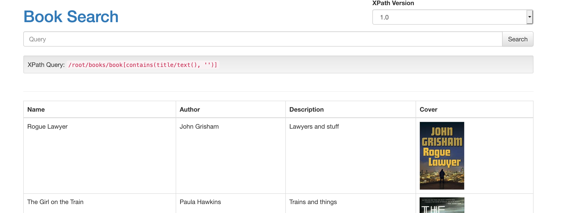

# XPath injection demonstration application

This is an example app that is vulnerable to xpath injection attacks. This is a standalone app for experimenting with 
xpath injection issues, or you can use it to test [the latest version of xcat](https://github.com/orf/xcat/).

## Quickstart

To quickly run the app with Docker:

`docker run -p 4567:4567 tomforbes/xcat-app`

Then visit http://localhost:4567 to see the site. As a starting point, the search `Rogue') and string('1'='1` will give 
you a boolean XPath injection you can play with.

The vulnerable `/` endpoint accepts both URL-encoded `GET` parameters as well as form-encoded `POST` parameters.

### Examples

`xcat run http://localhost:4567 query query=Rogue --true-string=Lawyer`

`xcat shell http://localhost:4567 query xversion=1.0 query=Rogue --true-string=Lawyer`

### Using OOB with Docker

When running inside Docker the IP address of your _host_ is different from the external IP address. When using 
xcat's `--oob` flag you must determine the host of your local machine relative to your docker container.

On Docker for mac you can use `host.docker.internal`. On Linux it is more convoluted,
[see this stack overflow thread for more info](https://stackoverflow.com/questions/22944631/how-to-get-the-ip-address-of-the-docker-host-from-inside-a-docker-container)

You can also run the container with `--net=host`, which will mean the container runs inside your hosts network interface 
and does not have a separate IP.

## Building yourself

Requires jdk+

`mvn clean compile assembly:single`

### Run:

**Warning:** It is highly recommended to use the docker container if you are exposing this to anyone else, as this 
is insecure by default. Users will be able to read files (including private keys) on the filesystem.

`java -jar target/xcat-app-jar-with-dependencies.jar`

### Hide xpath queries log:

Add `-Dorg.slf4j.simpleLogger.defaultLogLevel=warn` to the `java` cmd.
